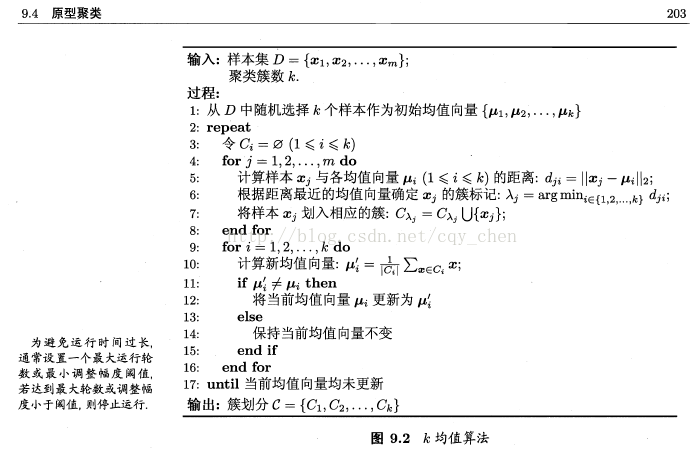
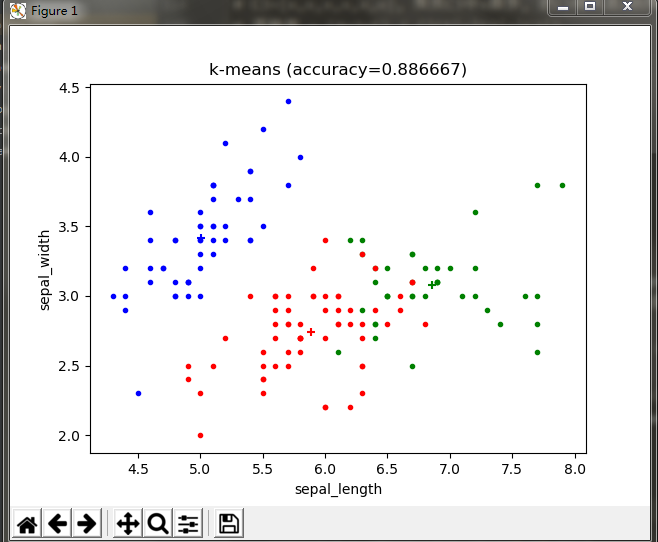
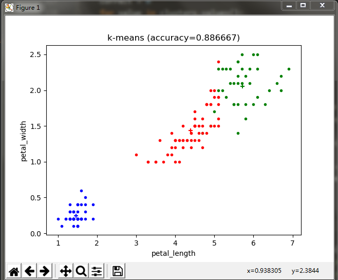

原始的K-Means算法. 伪代码：

使用iris数据集测试，下载地址[http://archive.ics.uci.edu/ml/index.php](http://archive.ics.uci.edu/ml/index.php). 每个数据对象有4个维度，4个维度都参与计算，但在二维平面上只能展示两个维度：

图1 使用`sepal_length`和`sepal_width`作为x,y轴

图2 使用`petal_length`和`petal_width`作为x,y轴